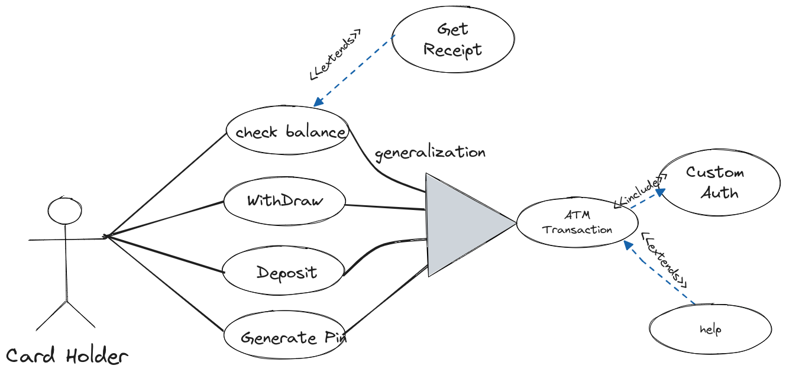
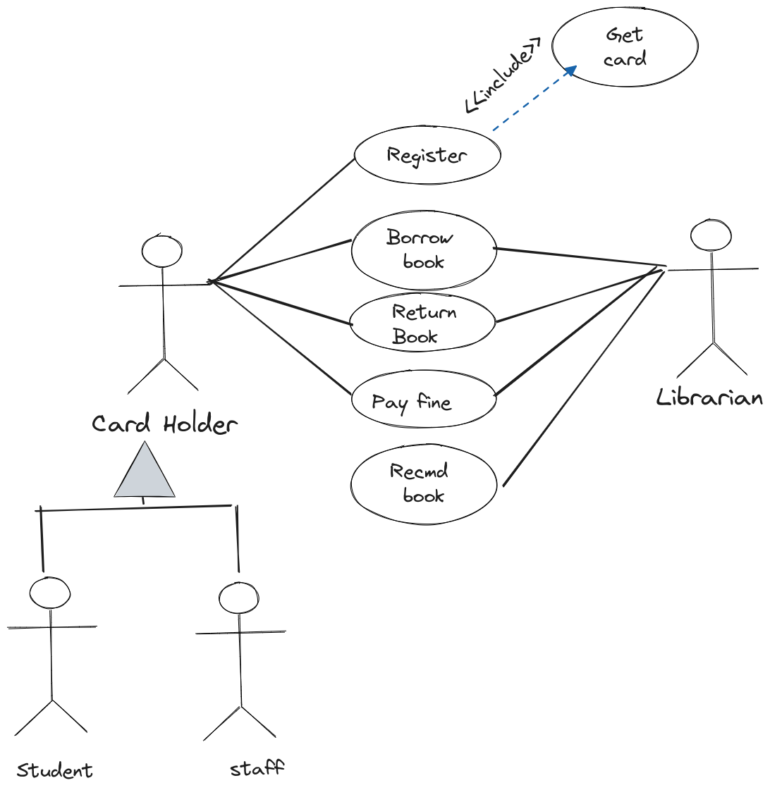


UseCase Diagrams:



click image to zoom in

 

  
  
  <!-- 
  
  
  
   -->


## (THEORY WEEK-1)

Unified Modeling Language (UML)



### 1. Introduction to UML

Unified Modeling Language (UML) is a comprehensive language used for visualizing, specifying, constructing, and documenting software systems. It provides a standardized approach to system design, allowing software professionals to communicate and understand complex concepts through visual representations.

### 2. Basic Building Blocks in UML

UML encompasses three fundamental building blocks: things, relationships, and diagrams. These components are essential for creating a comprehensive model of a software system.

#### 2.1 Things in UML

UML defines various types of things that represent both the static and dynamic aspects of a system:

- **Class:** Represents a template for creating objects, encapsulating attributes and behaviors.

- **Object:** An instance of a class, representing a real-world entity in the system.

- **Interface:** Describes a set of methods that a class or component must implement.

- **Use Case:** Represents a specific functionality or behavior of a system from an external perspective.

#### 2.2 Relationships in UML

UML allows the modeling of relationships between different elements, contributing to the overall structure of the system:

- **Association:** Describes a bi-directional relationship between two classes.

- **Aggregation:** Represents a "whole-part" relationship, where a whole is composed of parts.

- **Composition:** Denotes a strong form of aggregation, where the part is a component of the whole and cannot exist independently.

- **Inheritance:** Illustrates an "is-a" relationship between a superclass and its subclasses.

### 3. Types of Things in UML

#### 3.1 Structural Things

Structural things in UML focus on the static aspects of a system. Key types include classes, objects, and interfaces.
![[Pasted image 20231130143054.png]]
#### 3.2 Behavioral Things

Behavioral things in UML represent dynamic aspects, such as use cases and collaborations. Use cases define the functionality the system should provide.

### 4. Types of Relationships in UML

#### 4.1 Dependency

Denotes a relationship where a change in one thing may affect another.

#### 4.2 Association

Represents a connection between two classes, often denoting a bi-directional relationship.

#### 4.3 Generalization

Illustrates an "is-a" relationship, typically associated with inheritance.

#### 4.4 Realization

Shows how a class implements an interface.

### 5. Use Case Diagrams in Detail

Use case diagrams in UML focus on the functional requirements of a system. They include:

- **Actor:** Represents an external entity interacting with the system.

- **Use Case:** Describes a specific functionality or action the system can perform.

- **Relationships:** Connect actors and use cases, illustrating how external entities interact with the system.

Use case diagrams provide a high-level view of system functionality, aiding in understanding user interactions and system behavior.
